# Product Requirements Document (PRD)
## AI-Powered Appointment Booking System for Indian Dental Clinics

---

**Product Manager:** [Your Name]  
**Date:** May 17, 2026  
**Status:** ✅ Approved for Development  
**Version:** 1.0  
**Target Launch:** Q3 2026 (Beta: July, Public: September)

---

## Executive Summary

### Vision
Simplest appointment booking system for small Indian dental clinics that reduces no-shows by 50% and saves 10+ hours/week through WhatsApp-first automation.

### Solution
Mobile-first, WhatsApp-integrated booking system with:
- WhatsApp bot for 24/7 patient booking (Hindi/English)
- Automated reminders (24hr + 1hr before appointments)
- UPI advance payment (₹200-500) to reduce no-shows
- Mobile app for staff (schedule + walk-in management)
- Optional: AI voice calling

### Success Criteria (3 Months)

| Metric | Baseline | Target |
|--------|----------|--------|
| **No-Show Rate** | 25-30% | <12% |
| **Staff Scheduling Time** | 15 hrs/week | <5 hrs/week |
| **Booking Conversion** | 60% | 85% |
| **Patient Satisfaction** | 3.8/5 | 4.3/5 |
| **Revenue Impact** | Baseline | +₹30k/month |

---

## Goals & Objectives

### Business Goals
- **Primary:** 100 paying clinics in 6 months (₹3.5L MRR)
- 40% trial-to-paid conversion
- <10% monthly churn
- 30% referral-driven growth
- NPS >50

### User Goals

**Clinic Staff:**
- Instant WhatsApp responses (even when busy)
- Zero double-bookings
- No manual reminder calls
- Work-life balance restored

**Clinic Owners:**
- No-show rate: 28% → <12%
- 20-25 patients/day consistently
- ROI: ₹30k+ monthly savings
- Professional image

**Patients:**
- Book in <2 minutes via WhatsApp
- Instant confirmation
- Automated reminders
- UPI advance payment

---

## Out of Scope (V1)

❌ Multi-clinic management  
❌ Electronic medical records (EMR)  
❌ Lab integrations  
❌ Inventory management  
❌ Google Calendar sync  
❌ Patient portal/login  
❌ Insurance claim processing  
❌ Regional languages beyond Hindi  
❌ Desktop/web version for staff  
❌ Video consultations

**Rationale:** Focus on 5 core features that solve the critical problem. Additional features based on usage data.

---

## Product Architecture

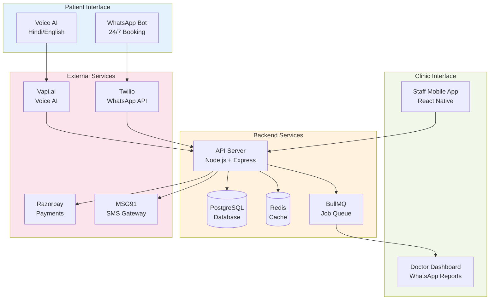

---

## System Context Diagram

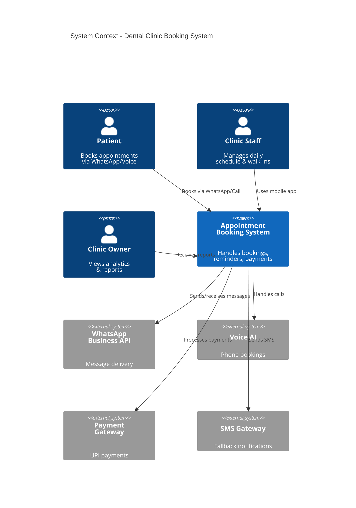

---

## Core Features & Requirements

### 1. Patient Booking (WhatsApp Bot)

#### 1.1 Booking Flow

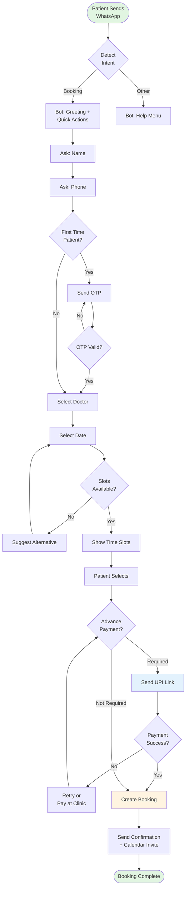

#### Booking Initiation
**User Story:** Patient messages clinic → bot responds in <5 seconds with options

**Acceptance Criteria:**
- Detects booking intent from: "appointment", "slot", "booking", Hindi equivalents
- Responds with: Clinic name + quick reply buttons [Today] [Tomorrow] [This Week] [Next Week]
- Works 24/7, even when clinic closed
- Multi-language: English + Hindi code-switching

**Technical:**
- WhatsApp Business API (Twilio/MessageBird)
- NLP: Keyword matching + GPT-4 fallback
- Response time <5 sec (95th percentile)

---

#### Slot Selection
**User Story:** Patient sees available slots → selects time → instant confirmation

**Acceptance Criteria:**
- Displays slots as clickable buttons (e.g., [6:00 PM] [6:30 PM] [7:00 PM])
- Shows 12-hour format, doctor name (if multiple)
- Real-time availability (no double-booking)
- Max 6 slots shown at once
- Grayed-out unavailable slots

**Technical:**
- API: `GET /availability?date=YYYY-MM-DD&clinicId=X`
- Slot algorithm: 30-min intervals, buffer time, existing bookings
- Concurrent booking protection: Optimistic locking
- Response time <500ms

**Business Rules:**
- Don't show past slots
- Account for: Clinic hours, doctor availability, buffer time (10 min)
- If all slots full → suggest next available date

---

#### UPI Advance Payment
**User Story:** Patient pays ₹200 advance via UPI to secure slot

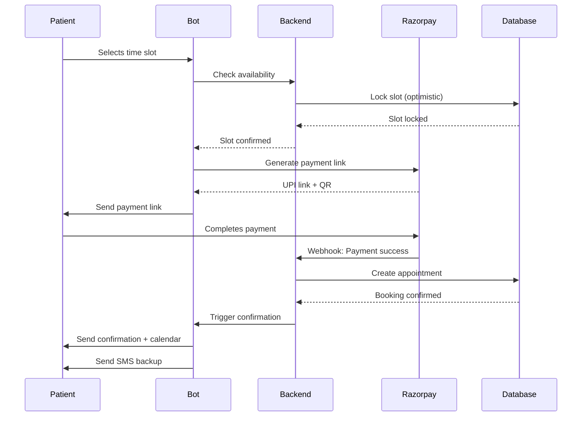

**Acceptance Criteria:**
- Payment link opens PhonePe/Google Pay directly (UPI intent)
- Backup: QR code image
- Amount: ₹200 (clinic-configurable ₹100-500)
- Timeout: 5 minutes
- Success → confirmation + receipt PDF
- Failure → retry option or "Pay at Clinic"

**Technical:**
- Razorpay Payment Gateway
- Webhook: Payment status (success/failure)
- Refund API ready

**Refund Policy:**
- 24+ hrs before: 100% refund
- 12-24 hrs: 50% refund
- <12 hrs: No refund

---

### 2. Staff Mobile App

#### 2.1 App Information Architecture

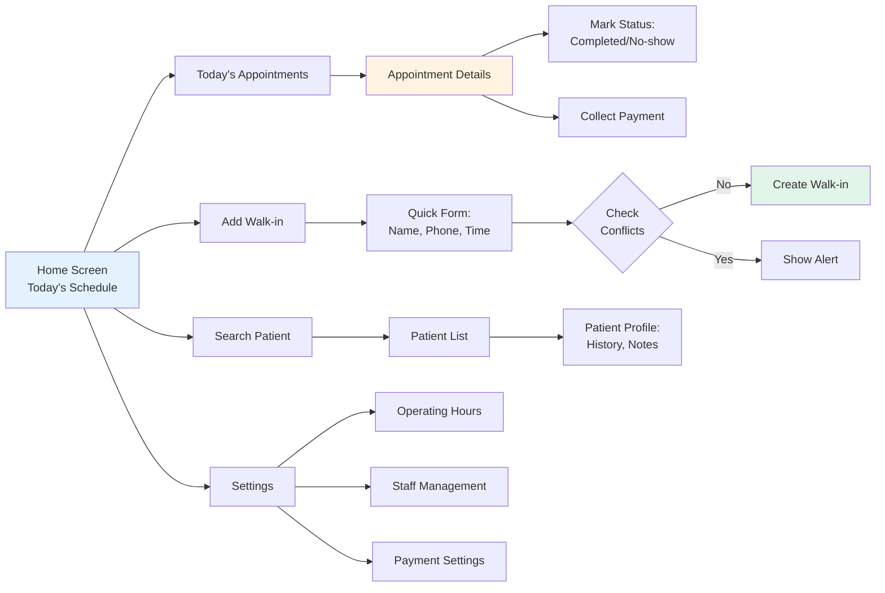

#### 2.2 Daily Schedule View
**User Story:** Staff views today's appointments on home screen

**Acceptance Criteria:**
- Default: Today's appointments (chronological list)
- Each card shows:
  - Time, Patient name, Phone (click-to-call)
  - Status: [Confirmed] [Pending] [Walk-in] [Completed] [No-show]
  - Payment: ₹200 paid, ₹800 pending
- Color-coded: Green (confirmed), Yellow (pending), Blue (walk-in), Gray (completed), Red (no-show)
- Pull-to-refresh for updates
- Real-time push notifications for new bookings

**Technical:**
- React Native (Android first)
- API: `GET /appointments?date=today&clinicId=X`
- WebSocket for real-time updates
- Offline cache + sync

**Performance:**
- Load time <2 seconds
- Works offline (cached data)
- Touch targets ≥44px

---

### 3. Automated Reminder System

#### 3.1 Reminder Flow

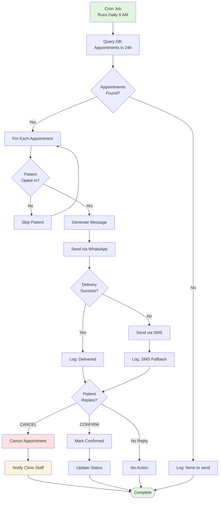

**Reminder Types:**

**Immediate confirmation:**
- WhatsApp message + Google Calendar .ics + SMS fallback

**24-hour reminder:**
```
Reminder: Tomorrow 6:00 PM appointment
Dr. Priya at Smile Dental Clinic
[Confirm] [Reschedule] [Directions]
```
- Sent 6pm day before
- WhatsApp + SMS (both)

**1-hour reminder:**
```
Your appointment is in 1 hour (6:00 PM).
See you soon! 😊
[Get Directions]
```

**Post-appointment (2 hrs after):**
```
Thanks for visiting!
Rate your experience: [5★] [4★] [3★] [2★] [1★]
```

**Technical:**
- Cron job (every 10 min, check reminders due)
- WhatsApp Business API templates (pre-approved)
- SMS gateway (MSG91/Twilio fallback)
- Calendar generation (.ics format)

---

### 4. Doctor Dashboard

#### 4.1 Analytics & Reporting

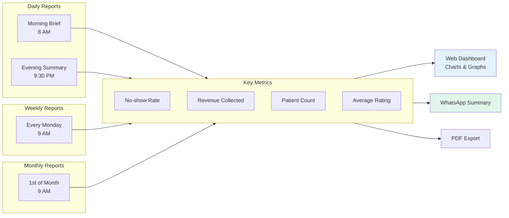

**Daily Summary via WhatsApp:**

**Morning (8:00 AM):**
```
Good Morning Dr. Priya! ☀️

Today's Schedule (Thu 16th May):
📋 12 appointments booked
✅ 10 confirmed
⏳ 2 pending confirmation

Peak hours: 6-7pm (4 appointments)

[View Full Schedule]
```

**Evening (9:30 PM):**
```
Today's Summary 📊

Patients seen: 18
- Booked: 15
- Walk-ins: 3

No-shows: 2 (Ram Sharma 6pm, Priya Patil 7:30pm)

Revenue: ₹22,400
- Collected: ₹18,600
- Pending: ₹3,800

[Detailed Report]
```

---

### 5. Data Model

#### 5.1 Entity Relationship Diagram

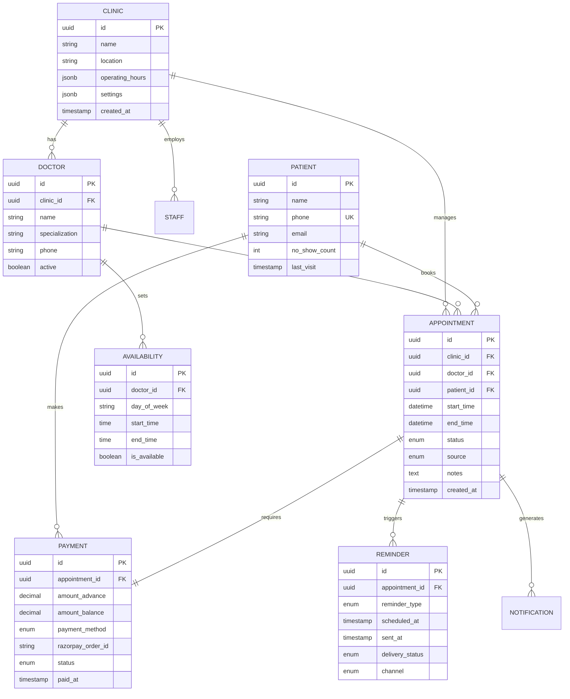

---

## Non-Functional Requirements

### Performance

| Metric | Target | Measurement |
|--------|--------|-------------|
| WhatsApp bot response | <5 sec (P95) | Message → reply |
| Availability API | <500ms | Query + calculation |
| App launch (cold start) | <2 sec | To usable screen |
| App screen load | <1 sec | Cached instant, API background |
| Payment link generation | <3 sec | After booking confirmed |

### Reliability
- **Uptime:** 99.5% during clinic hours (5-9pm IST)
- **Message delivery:** 98%+ (SMS fallback)
- **Database backup:** Hourly, 30-day retention
- **Payment success:** 95%+ (Razorpay standard)

### Scalability
- 500 clinics × 20 patients/day = 10,000 bookings/day
- 50,000 WhatsApp messages/day
- PostgreSQL with read replicas (10M appointments/year)
- Auto-scaling for peak load (6-8pm IST)

### Security
- **Encryption:** AES-256 at rest, TLS 1.3 in transit
- **PII:** Phone numbers hashed, names not in logs
- **Payments:** PCI-DSS compliant (Razorpay)
- **Auth:** JWT tokens (24hr expiry)
- **Rate limiting:** 10 requests/min per IP

### Compatibility
- **Android:** 8.0+ (API 26+, covers 95% devices)
- **iOS:** Phase 2
- **WhatsApp:** Latest (2-year back-compat)
- **Browsers:** Chrome, Firefox, Safari (last 2 versions)

### Data & Privacy
- **Residency:** India (AWS Mumbai)
- **GDPR-inspired:** Right to delete
- **Retention:** >2 years archived, >5 years deleted
- **Consent:** Explicit opt-in for marketing
- **Compliance:** DISHA-aware

---

## Deployment Architecture

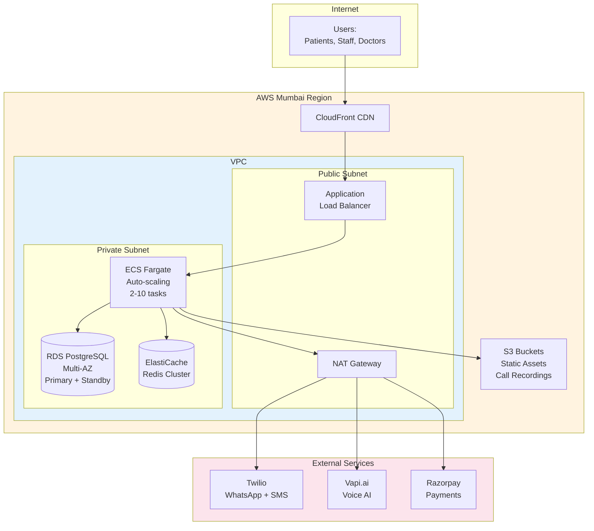

---

## Testing Requirements

### Test Pyramid

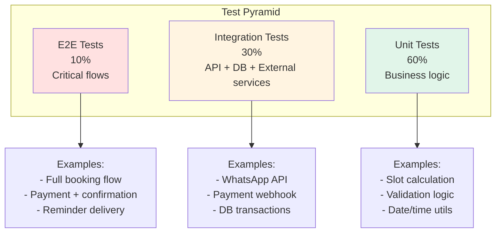

### Unit Tests
- Backend APIs: 80%+ coverage
- Payment flows: 100% coverage
- Booking logic: All edge cases

### Integration Tests
- WhatsApp end-to-end booking
- Payment gateway (mock Razorpay)
- Voice AI (mock Vapi)

### UAT (Beta Phase, 10 Clinics)
- 2-week trial
- Daily feedback calls
- Track: No-show reduction, satisfaction, bugs

**Launch Gates:**
- <5% app crash rate
- <1% payment failure rate
- 70%+ booking completion rate
- 4.0+ star rating from beta users

---

## Launch Plan

### Phase Timeline

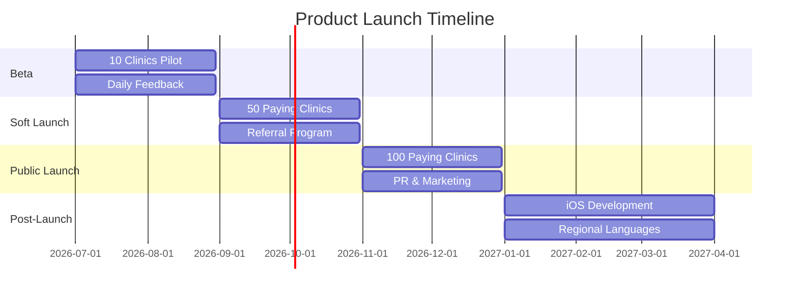

### Phase 1: Beta (Month 1-2)
**Goal:** Validate PMF with 10 clinics

**Success Criteria:**
- 8/10 use daily
- 20%+ no-show reduction (5+ clinics)
- 6/10 willing to pay ₹3,500/month
- <10 critical bugs

---

### Phase 2: Soft Launch (Month 3-4)
**Goal:** 50 paying clinics

**GTM:**
- Referral program ("Refer dentist, both get ₹1k credit")
- YouTube testimonials
- Dentist WhatsApp groups
- Google Ads ("Reduce no-shows 50%")

**Pricing:**
- Free trial: 1 month
- Paid: ₹3,500/month (cancel anytime)
- Annual: ₹35,000/year (17% discount)

**Success Criteria:**
- 40% trial → paid
- <15% churn
- NPS >40
- 20% referral-driven

---

### Phase 3: Public Launch (Month 5-6)
**Goal:** 100 paying clinics (₹3.5L MRR)

**Marketing:**
- PR (TechCrunch, YourStory)
- IDA conference booth
- Dental influencers
- Case studies

**Product:**
- iOS app (if demand)
- Regional languages (Tamil, Telugu)
- Advanced analytics

**Success Criteria:**
- 100 paying clinics
- ₹3.5L MRR
- <10% churn
- NPS >50

---

## Technical Stack

### Technology Decisions

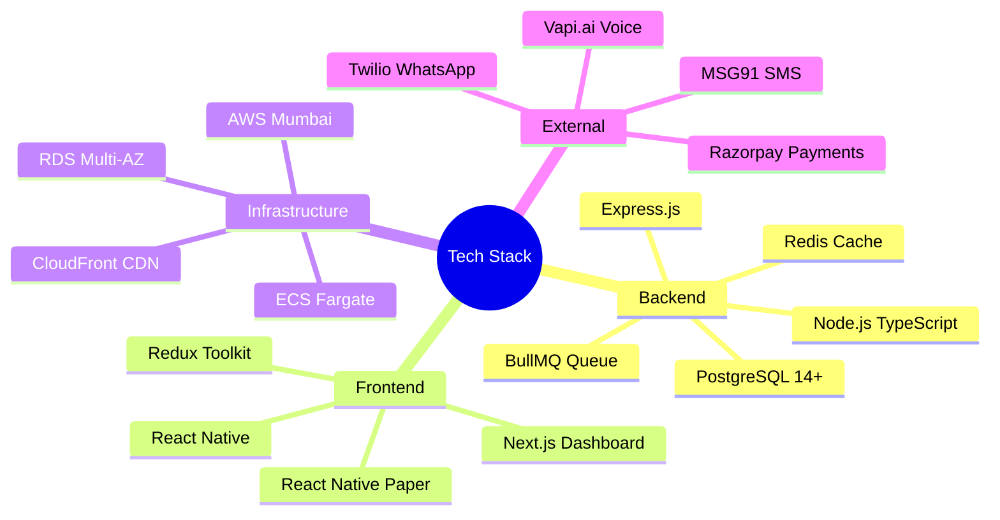

### Backend
- **Language:** Node.js (TypeScript)
- **Framework:** Express.js
- **Database:** PostgreSQL 14+ (AWS RDS)
- **Caching:** Redis (ElastiCache)
- **Queue:** BullMQ (async tasks)

### Frontend
- **Mobile:** React Native
- **State:** Redux Toolkit
- **UI:** React Native Paper
- **Dashboard:** Next.js + Tailwind CSS

### Infrastructure
- **Hosting:** AWS Mumbai (ECS Fargate, RDS Multi-AZ, S3, CloudFront)
- **Monitoring:** CloudWatch + Sentry
- **CI/CD:** GitHub Actions, blue-green deployment

---

## Pricing

| Plan | Price | Target | Features |
|------|-------|--------|----------|
| **Free Trial** | ₹0 | New clinics | 1 month, 50 bookings max |
| **Starter** | ₹3,500/month | 1-2 dentists | Unlimited bookings, WhatsApp, SMS, mobile app |
| **Growth** | ₹5,500/month | 3+ dentists | Starter + AI voice + priority support |
| **Annual** | ₹35,000/year | Price-conscious | Starter annual (save 17%) |

**Add-ons:**
- AI Voice: +₹1,500/month
- Custom branding: +₹1,000/month
- Dedicated phone: +₹500/month

---

## Risks & Mitigation

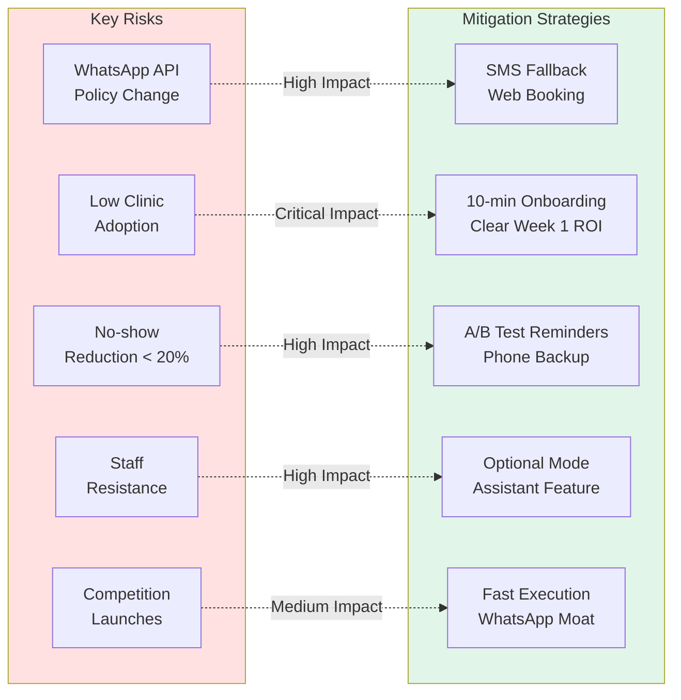

| Risk | Impact | Probability | Mitigation |
|------|--------|-------------|------------|
| WhatsApp API policy change | High | Medium | SMS fallback, web booking alternative |
| Low clinic adoption | Critical | Medium | 10-min onboarding, clear Week 1 ROI demonstration |
| No-show reduction <20% | High | Low | A/B test reminder timings, add phone call backup |
| Staff resistance to app | High | Medium | Launch optional mode, "assistant" feature first |
| Competition launches similar | Medium | Medium | Fast execution, WhatsApp-first moat, annual lock-in |

---

## Development Roadmap

**Sprint 1-2 (Weeks 1-4):** Database schema, backend API scaffolding, WhatsApp integration, staff app (login + schedule view)

**Sprint 3-4 (Weeks 5-8):** Complete booking flow, Razorpay integration, SMS reminders, staff app (walk-in + status management)

**Sprint 5-6 (Weeks 9-12):** AI voice calling, doctor dashboard, analytics, beta testing with 10 clinics

**Sprint 7-8 (Weeks 13-16):** Onboarding optimization, performance testing, security audit, Google Play submission

**Post-Launch:** iOS app development, regional language support, advanced analytics features

---

## Definition of Done

**Per Feature:**
- [ ] Code reviewed by 2 engineers
- [ ] Unit tests (80%+ coverage)
- [ ] Integration tests pass
- [ ] Tested on ₹10-15k Android phones
- [ ] Hindi + English UI verified
- [ ] Technical documentation complete
- [ ] Deployed to staging environment
- [ ] PM verification completed
- [ ] Demo video recorded

**MVP Launch Checklist:**
- [ ] 10 beta clinics using for 2+ weeks
- [ ] No P0/P1 bugs remaining
- [ ] <1% payment failure rate
- [ ] 70%+ booking completion rate
- [ ] 4.0+ star rating from beta users
- [ ] Legal review complete (T&C, Privacy Policy)
- [ ] Customer support playbook ready
- [ ] Monitoring and alerting configured

---

## Appendix

### API Endpoints Summary

```
Authentication
POST   /auth/login              - Staff/doctor login
POST   /auth/otp                - Send OTP to patient

Appointments
GET    /appointments            - List appointments
POST   /appointments            - Create appointment
GET    /appointments/:id        - Get appointment details
PATCH  /appointments/:id/status - Update status
DELETE /appointments/:id        - Cancel appointment

Availability
GET    /availability            - Check available slots
POST   /availability            - Set doctor availability
PATCH  /availability/:id        - Update availability

Patients
GET    /patients                - List patients
GET    /patients/:id            - Get patient profile
POST   /patients                - Create patient
PATCH  /patients/:id            - Update patient

Payments
POST   /payments                - Record payment
GET    /payments/:id            - Get payment details
POST   /payments/:id/refund     - Process refund

Analytics
GET    /analytics/daily         - Daily summary
GET    /analytics/weekly        - Weekly report
GET    /analytics/monthly       - Monthly report

WhatsApp Webhook
POST   /webhooks/whatsapp       - Incoming messages

Payment Webhook
POST   /webhooks/razorpay       - Payment notifications
```

### Glossary

- **No-show:** Patient books but doesn't arrive (no cancellation notice)
- **Walk-in:** Patient arrives without prior booking
- **Advance Payment:** Partial payment (₹200-500) to secure appointment slot
- **Buffer Time:** Gap between appointments for cleaning/preparation (typically 10 min)
- **Slot:** Fixed time interval for appointments (typically 30 minutes)
- **UPI:** Unified Payments Interface - India's real-time payment system
- **WhatsApp Business API:** Official API for automated WhatsApp messaging

---

**Document Status:** ✅ Approved for Development  
**Sign-Off:**
- Product Manager: [Your Name]  
- Engineering Lead: [Pending]  
- Design Lead: [Pending]  

**Next Steps:**
1. Engineering feasibility review (Week 1)
2. Design high-fidelity mockups (Week 1-2)
3. Sprint 1 planning meeting (Week 2)
4. Development kickoff (Week 3)

---

**Last Updated:** June 5, 2026  
**Version:** 1.0 — Initial PRD approved for production
