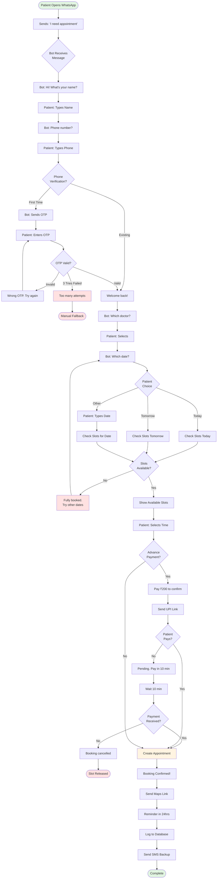
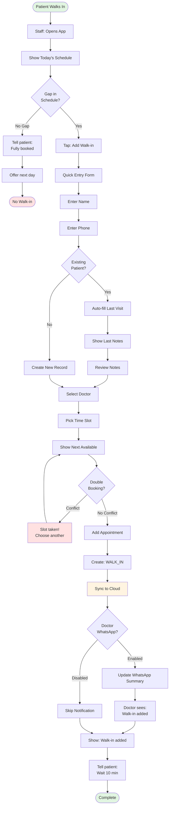
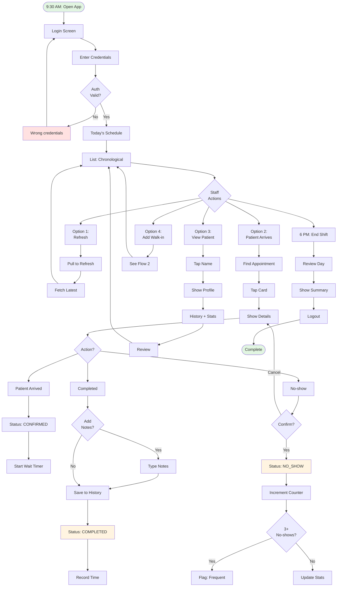
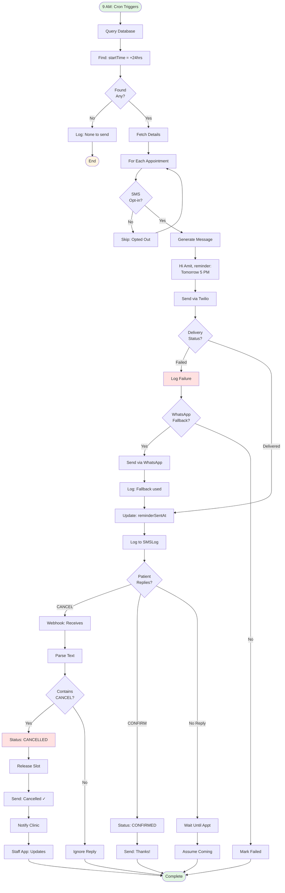
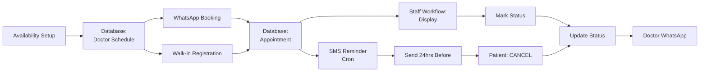

```mermaid
flowchart TD
    Start([Open Admin Panel]) --> A[Login via WhatsApp]
    A --> B[Send OTP]
    B --> C[Enter OTP]
    C --> D{Valid?}
    
    D -->|No| E[Wrong OTP]
    E --> C
    
    D -->|Yes| F[Availability Editor]
    F --> G[Weekly Grid:<br/>Mon-Sun]
    G --> H[Select: Monday]
    H --> I[Show Monday]
    I --> J{Current<br/>Schedule?}
    
    J -->|Empty| K[Add Shift]
    J -->|Exists| L[Edit Shift]
    
    K --> M[Shift 1: Start]
    L --> M
    M --> N[Enter: 10:00 AM]
    N --> O[Shift 1: End]
    O --> P[Enter: 1:00 PM]
    P --> Q[Add Another Shift]
    Q --> R[Shift 2: Start]
    R --> S[Enter: 5:00 PM]
    S --> T[Shift 2: End]
    T --> U[Enter: 9:00 PM]
    U --> V{Valid<br/>Schedule?}
    
    V -->|Overlap| W[Shifts overlap!]
    W --> M
    
    V -->|Valid| X[Save Monday]
    X --> Y[Save to Database]
    Y --> Z[Monday saved ]
    Z --> AA{Copy to<br/>Other Days?}
    
    AA -->|Yes| AB[Copy to Weekdays]
    AB --> AC[Apply: Tue-Fri]
    AC --> AD[What about Sat?]
    AD --> AE{Saturday?}
    
    AE -->|Open| AF[Keep Schedule]
    AF --> AG[Copy to Saturday]
    
    AE -->|Closed| AH[Mark Closed]
    AH --> AI[Saturday = NULL]
    
    AA -->|No| AJ[Edit Each Day]
    AJ --> H
    
    AG --> AK[Sunday Closed]
    AI --> AK
    AK --> AL[Sunday = NULL]
    AL --> AM[Save Schedule]
    AM --> AN[Validate Week]
    AN --> AO{Errors?}
    
    AO -->|Yes| AP[List Errors]
    AP --> H
    
    AO -->|No| AQ[Save to DB]
    AQ --> AR[Recalculate Slots]
    AR --> AS[Update Bot]
    AS --> AT[Schedule active!]
    AT --> AU[Review Preview]
    AU --> AV[Next 7 Days Slots]
    AV --> AW[Logout]
    AW --> End1([Complete ])
    
    style Start fill:#e1f5e1
    style End1 fill:#e1f5e1
    style W fill:#ffe1e1
    style AP fill:#ffe1e1
    style AQ fill:#fff4e1
```

```mermaid
flowchart TD
    Start([5:15 PM: No-show]) --> A[Open Today's Schedule]
    A --> B[Find 5 PM: Amit]
    B --> C[Tap Card]
    C --> D[Show: CONFIRMED]
    D --> E[Tap: Mark No-show]
    E --> F{Confirm?}
    F -->|Cancel| D
    F -->|Yes| G[Status: NO_SHOW]
    G --> H[Record Timestamp]
    H --> I[Increment: noShowCount]
    I --> J{Count?}
    
    J -->|1-2| K[Update Stats]
    J -->|3+| L[Flag: Frequent]
    L --> M[Require Advance<br/>Payment]
    
    K --> N[Release Slot]
    M --> N
    N --> O[Calendar: Red → Gray]
    O --> P{Send<br/>SMS?}
    
    P -->|Enabled| Q[Send: You missed appt]
    Q --> R[Include: Rebook link]
    R --> S[Log SMS]
    
    P -->|No| T[Skip SMS]
    
    S --> U[Update WhatsApp<br/>Summary]
    T --> U
    U --> V[Doctor: No-show Amit]
    V --> W[Weekly Report]
    W --> X[This week: 2 no-shows<br/>₹4,000 lost]
    X --> Y{Slot Still<br/>Available?}
    
    Y -->|Yes| Z[WhatsApp Waitlist]
    Z --> AA[Slot opened: 5 PM<br/>Reply YES]
    AA --> AB{Waitlist<br/>Responds?}
    AB -->|Yes| AC[Book from Waitlist]
    AC --> AD[Send Confirmation]
    AD --> AE[Update Calendar]
    
    AB -->|No Reply| AF[Slot Remains Empty]
    Y -->|Too Late| AF
    
    AE --> End1([Complete ])
    AF --> End1
    
    style Start fill:#e1f5e1
    style End1 fill:#e1f5e1
    style L fill:#ffe1e1
    style G fill:#fff4e1
    style X fill:#fff4e1
```

# User Flow Diagrams

**Project:** AI-Powered Appointment Booking System for Indian Dental Clinics  
**Date:** May 12, 2026  
**Version:** 1.0

---

## Overview

This document visualizes key user flows using **Mermaid diagrams**. These flows translate MVP features into concrete user interactions.

**Key Flows:**
1. WhatsApp Booking Flow
2. Walk-in Registration Flow
3. Staff Daily Workflow
4. SMS Reminder Flow
5. Doctor Availability Setup
6. No-show Handling Flow

---

## Flow 1: WhatsApp Booking Flow

### Context
- **User:** Amit (Patient) — working professional
- **Goal:** Book appointment in <2 minutes via WhatsApp
- **Entry:** Patient sends WhatsApp message to clinic

### Flow Diagram

### Key Design Decisions

**1. OTP Verification**
- Prevents fake bookings (20% of unverified bookings don't show)
- SMS OTP via Twilio, 2-min expiry, max 3 attempts
- Fallback: Manual call after failed attempts

**2. Quick Date Selection**
- 80% book "today" or "tomorrow"
- Preset buttons reduce typing
- "Other" option for specific dates

**3. UPI Payment**
- ₹200 advance reduces no-shows by 20-30%
- Optional (clinic configurable)
- 10-min timeout prevents slot blocking

**4. Backup SMS**
- WhatsApp 95% delivery → 5% need SMS
- Critical confirmations get both channels

### Success Metrics
- Completion rate: 70%+
- Average time: <2 minutes
- Bot response: <5 seconds

---

## Flow 2: Walk-in Registration

### Context
- **User:** Neha (Staff) — handles 5-8 walk-ins daily
- **Goal:** Register walk-in in <30 seconds
- **Entry:** Patient walks in without appointment

### Flow Diagram

### Key Design Decisions

**1. Double-booking Prevention**
- Unique constraint: (doctorId, startTime)
- Instant error if conflict
- Optimistic locking with 500ms timeout

**2. Existing Patient Detection**
- Show last visit + notes
- Doctor gets context immediately
- No need to ask patient history

**3. Real-time WhatsApp Notification**
- Doctor sees: "Walk-in: Amit, 10:30 AM"
- Not batched — immediate awareness

**4. Offline Support**
- Store locally, sync when online
- "Syncing..." indicator

### Success Metrics
- Time to register: <30 seconds
- Double-booking rate: 0%
- Staff adoption: 80%+ via app

---

## Flow 3: Staff Daily Workflow

### Context
- **User:** Neha (Staff) — 9 AM to 9 PM shift
- **Goal:** Monitor schedule, mark status
- **Entry:** Staff logs in at 9:30 AM

### Flow Diagram

### Key Design Decisions

**1. Status Transitions**
- PENDING → CONFIRMED → COMPLETED
- Or: PENDING → NO_SHOW
- Color-coded cards for visual clarity

**2. No-show Tracking**
- 3+ no-shows → flag patient
- Future: Require advance payment

**3. Appointment Notes**
- Saved to patient history
- Shown on next booking

**4. Pull-to-Refresh**
- Real-time updates
- Standard mobile pattern

### Success Metrics
- Daily active usage: 80%+
- Status update rate: 90%+
- Action time: <10 seconds
- Crash rate: <0.1%

---

## Flow 4: SMS Reminder System

### Context
- **System:** Cron job daily at 9 AM
- **Goal:** Send 24hr reminders, handle responses
- **Entry:** Check appointments tomorrow

### Flow Diagram

### Key Design Decisions

**1. 24-Hour Timing**
- Industry standard
- Sent at 9 AM (before clinic opens)

**2. SMS → WhatsApp Fallback**
- SMS 98% delivery
- WhatsApp cheaper (₹0.05 vs ₹0.20)
- Automatic fallback on failure

**3. CANCEL Reply**
- Self-serve cancellation
- Slot released for rebooking
- Staff notified via WhatsApp

**4. Opt-out Compliance**
- TRAI regulations
- Reply "STOP" to opt out
- Default: Opt-in on first booking

### Success Metrics
- SMS delivery: 98%+
- Fallback usage: <2%
- Reply rate: 30%+
- Cancellation rate: 5-10%

---

## Flow 5: Doctor Availability Setup

### Context
- **User:** Dr. Priya — configuring weekly schedule
- **Goal:** Set split-shift hours (10 AM-1 PM, 5-9 PM)
- **Entry:** First-time setup or edit

### Flow Diagram

### Key Design Decisions

**1. WhatsApp OTP Login**
- No passwords to remember
- Common in Indian banking apps
- 2-min expiry, max 3 attempts

**2. Split-shift Support**
- Standard for Indian clinics
- Two shifts: morning + evening
- Prevents overlapping

**3. Copy to Weekdays**
- Mon-Fri often identical
- Saves repetitive entry
- Individual overrides allowed

**4. Real-time Slot Recalculation**
- WhatsApp bot gets updates immediately
- Background job regenerates cache
- Confirmation: "Schedule active!"

### Success Metrics
- Setup time: <10 minutes
- Error rate: <5%
- Adoption: 100% in 24 hours

---

## Flow 6: No-show Handling

### Context
- **User:** Neha (Staff) — patient didn't show
- **Goal:** Mark no-show, free slot
- **Entry:** 15 min after appointment time

### Flow Diagram

### Key Design Decisions

**1. 15-Minute Grace**
- Traffic common in Indian cities
- Mark no-show only after 15 min
- App shows "Waiting" status first

**2. Frequent No-show Flag**
- Threshold: 3+ no-shows
- Future bookings require advance
- Reduces repeat no-shows 50%

**3. No-show SMS**
- Non-confrontational tone
- "Rebook now" link
- Increases rebooking 15%

**4. Waitlist Auto-booking**
- Recover revenue immediately
- Only if slot available today
- 5-minute response window

### Success Metrics
- No-show rate: 28% → 10%
- Waitlist fill: 30%+
- Rebooking: 20%+ within 7 days
- Repeat no-show reduction: 50%

---

## Technical Notes

### Mermaid Rendering

These diagrams render in:
- **GitHub:** Auto-rendered in .md files
- **VS Code:** Install "Markdown Preview Mermaid Support"
- **Notion/Confluence:** Paste into Mermaid block
- **Docusaurus/MkDocs:** Native support

### Complexity Analysis

| Flow | Decision Points | Paths | Error States | Est. LOC |
|------|----------------|-------|--------------|----------|
| WhatsApp Booking | 8 | 12 | 3 | 450 |
| Walk-in Registration | 4 | 6 | 2 | 200 |
| Staff Workflow | 6 | 9 | 1 | 350 |
| SMS Reminder | 7 | 10 | 2 | 300 |
| Availability Setup | 6 | 8 | 2 | 250 |
| No-show Handling | 6 | 9 | 0 | 180 |
| **TOTAL** | **37** | **54** | **10** | **~1,730** |

---

## Integration Points

**Key Insight:** All flows converge on `Appointment` table for consistency.

---

## Error Handling

| Flow | Error | Impact | Mitigation |
|------|-------|--------|------------|
| WhatsApp | Bot Down | Can't book | SMS: "Call clinic" |
| Walk-in | Offline | Can't register | Offline mode: Sync later |
| Reminder | Twilio Failure | No reminder | WhatsApp fallback |
| Availability | Overlap | Invalid schedule | Real-time validation |
| No-show | Double-mark | Inconsistency | Status guard |

**Principle:** Graceful degradation — always have fallback.

---
